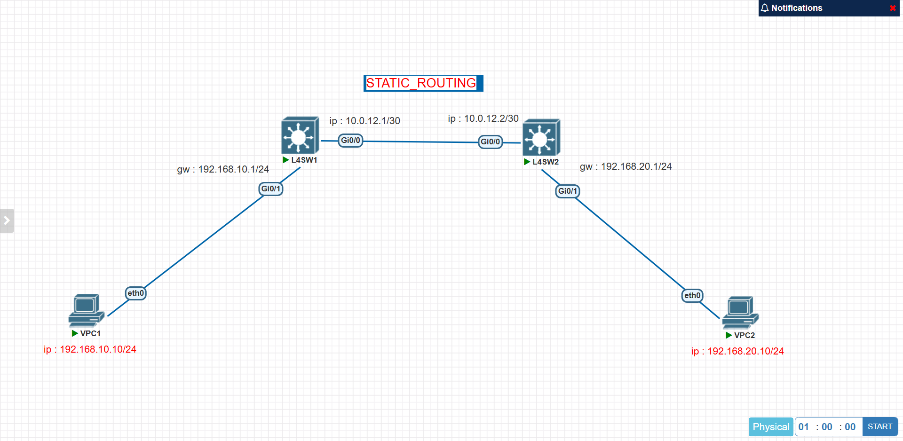

# 01. Static Routing

## 1. Lab Overview

이 실습은 PNETLab에서 VPC 2대와 L4 Switch 2대를 사용하여 서로 다른 네트워크 간 Static Routing 통신을 구성하고 검증하는 실습입니다.

단순히 end-to-end ping 성공만 확인하는 것이 아니라, VPC의 Gateway 설정, L4 Switch 인터페이스 IP 설정, Static Route 구성, Routing Table 확인, 구간별 ping 검증을 통해 정적 라우팅 동작을 확인했습니다.

---

## 2. Topology



```text
VPC1 --- L4SW1 --- L4SW2 --- VPC2
```

---

## 3. Device Role

| Device | Role |
|---|---|
| VPC1 | 192.168.10.0/24 대역의 사용자 PC |
| L4SW1 | VPC1 네트워크의 Gateway 및 Static Routing 장비 |
| L4SW2 | VPC2 네트워크의 Gateway 및 Static Routing 장비 |
| VPC2 | 192.168.20.0/24 대역의 원격 PC |

---

## 4. IP Address Plan

| Device | Interface | IP Address | Description |
|---|---|---|---|
| VPC1 | eth0 | 192.168.10.10/24 | VPC1 IP |
| L4SW1 | Gi0/1 | 192.168.10.1/24 | VPC1 Gateway |
| L4SW1 | Gi0/0 | 10.0.12.1/30 | L4SW 간 연결 |
| L4SW2 | Gi0/0 | 10.0.12.2/30 | L4SW 간 연결 |
| L4SW2 | Gi0/1 | 192.168.20.1/24 | VPC2 Gateway |
| VPC2 | eth0 | 192.168.20.10/24 | VPC2 IP |

---

## 5. VPC Configuration

### VPC1


```text
ip 192.168.10.10/24 192.168.10.1
show ip
save
```

### VPC2


```text
ip 192.168.20.10/24 192.168.20.1
show ip
save
```

---

## 6. L4 Switch Configuration

### L4SW1 Configuration

```text
enable
configure terminal
hostname L4SW1

ip routing

interface Gi0/1
 no switchport
 ip address 192.168.10.1 255.255.255.0
 no shutdown
exit

interface Gi0/0
 no switchport
 ip address 10.0.12.1 255.255.255.252
 no shutdown
exit

ip route 192.168.20.0 255.255.255.0 10.0.12.2

end
write memory
```

### L4SW2 Configuration

```text
enable
configure terminal
hostname L4SW2

ip routing

interface Gi0/0
 no switchport
 ip address 10.0.12.2 255.255.255.252
 no shutdown
exit

interface Gi0/1
 no switchport
 ip address 192.168.20.1 255.255.255.0
 no shutdown
exit

ip route 192.168.10.0 255.255.255.0 10.0.12.1

end
write memory
```

---

## 7. Interface Verification

### L4SW1 Interface Status


| Interface | IP Address | Role |
|---|---|---|
| Gi0/1 | 192.168.10.1/24 | VPC1 Gateway |
| Gi0/0 | 10.0.12.1/30 | Link to L4SW2 |

### L4SW2 Interface Status


| Interface | IP Address | Role |
|---|---|---|
| Gi0/0 | 10.0.12.2/30 | Link to L4SW1 |
| Gi0/1 | 192.168.20.1/24 | VPC2 Gateway |

---

## 8. Static Routing Configuration

### L4SW1 Static Route

L4SW1은 VPC2 네트워크인 `192.168.20.0/24`로 가기 위해 Next-Hop을 L4SW2의 링크 IP인 `10.0.12.2`로 설정했습니다.

```text
ip route 192.168.20.0 255.255.255.0 10.0.12.2
```


### L4SW2 Static Route

L4SW2는 VPC1 네트워크인 `192.168.10.0/24`로 가기 위해 Next-Hop을 L4SW1의 링크 IP인 `10.0.12.1`로 설정했습니다.

```text
ip route 192.168.10.0 255.255.255.0 10.0.12.1
```


---

## 9. Configuration Files

| Device | Config File |
|---|---|
| VPC1 | [vpc1_config_commands.txt](./configs/vpc1_config_commands.txt) |
| VPC2 | [vpc2_config_commands.txt](./configs/vpc2_config_commands.txt) |
| L4SW1 | [l4sw1_config_commands.txt](./configs/l4sw1_config_commands.txt) |
| L4SW2 | [l4sw2_config_commands.txt](./configs/l4sw2_config_commands.txt) |

---

## 10. Connectivity Verification


VPC1에서 가까운 구간부터 순서대로 ping을 수행했습니다.

| Test | Command | Result |
|---|---|---|
| VPC1 → Gateway | `ping 192.168.10.1` | Success |
| VPC1 → L4SW2 Link IP | `ping 10.0.12.2` | Success |
| VPC1 → VPC2 | `ping 192.168.20.10` | Success |

최종적으로 VPC1에서 원격 네트워크의 VPC2까지 통신이 성공했으므로 Static Routing 기반 end-to-end 통신이 정상 동작함을 확인했습니다.

---

## 11. Verification Log

검증 결과는 아래 파일에 별도로 정리했습니다.

[verification_result.txt](./verification/verification_result.txt)

---

## 12. Troubleshooting Checklist

통신이 실패할 경우 아래 순서로 점검합니다.

```text
1. VPC IP 주소와 Gateway가 올바른가?
2. L4SW 인터페이스가 up/up 상태인가?
3. L4SW1과 L4SW2 간 10.0.12.0/30 링크 통신이 가능한가?
4. L4SW1에 192.168.20.0/24 정적 경로가 있는가?
5. L4SW2에 192.168.10.0/24 정적 경로가 있는가?
6. Routing Table에 Static Route가 정상적으로 표시되는가?
7. ARP 학습이 정상적으로 이루어졌는가?
```

---

## 13. Lab Result

| Item | Result |
|---|---|
| Topology 구성 | Success |
| VPC IP 설정 | Success |
| L4SW Interface IP 설정 | Success |
| Static Route 설정 | Success |
| Gateway Ping | Success |
| End-to-End Ping | Success |

---

## 14. What I Learned

- PNETLab에서 VPC와 L4 Switch를 이용해 기본 Static Routing 토폴로지를 구성하는 방법을 익혔습니다.
- 서로 다른 네트워크 간 통신을 위해 각 VPC의 Gateway 설정과 L4 Switch의 Static Route 설정이 필요하다는 것을 확인했습니다.
- Routing Table에서 목적지 네트워크와 Next-Hop 정보를 확인하는 방법을 실습했습니다.
- 통신 검증은 end-to-end ping부터 하지 않고, Gateway → 중간 링크 → 원격 PC 순서로 진행해야 장애 원인을 빠르게 좁힐 수 있음을 확인했습니다.
