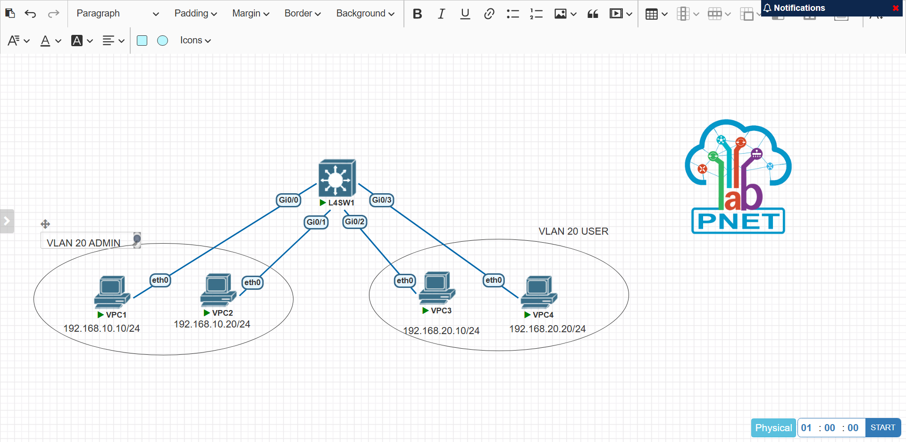
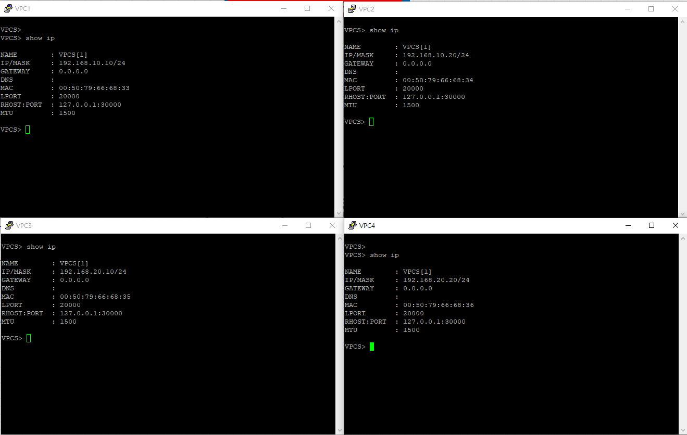
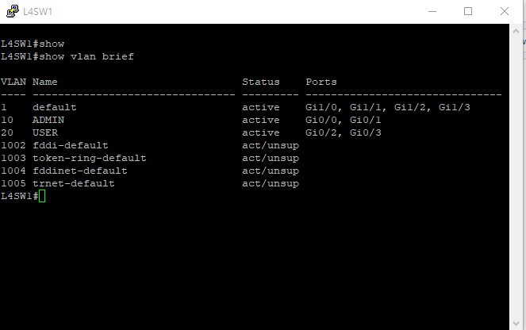
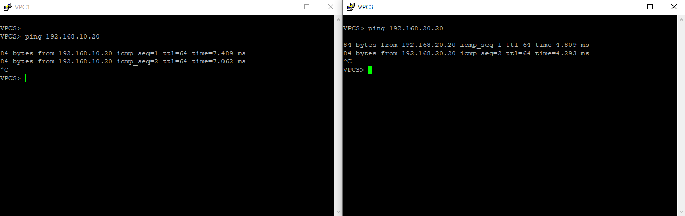
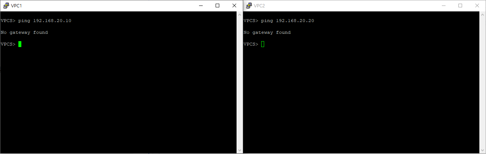
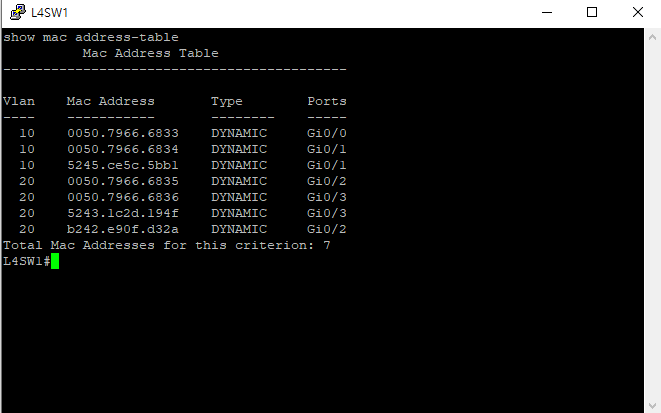

# 02. VLAN Access Port

## 1. Lab Overview

이 실습은 PNETLab에서 VPC 4대와 L4 Switch 1대를 사용하여 VLAN과 Access Port를 구성하고 검증하는 실습입니다.

VLAN 10과 VLAN 20을 분리하여 같은 VLAN에 속한 VPC끼리는 통신이 가능하고, 서로 다른 VLAN에 속한 VPC끼리는 통신이 불가능한 것을 확인했습니다.

이번 실습에서는 Inter-VLAN Routing을 구성하지 않았기 때문에 VLAN 간 통신 실패가 정상 결과입니다.

---

## 2. Topology



```text
VPC1 --- Gi0/0
VPC2 --- Gi0/1
          L4SW1
VPC3 --- Gi0/2
VPC4 --- Gi0/3
```

---

## 3. Lab Objectives

- VLAN 10과 VLAN 20을 생성한다.
- 스위치 포트를 Access Port로 설정한다.
- VLAN 10에는 VPC1, VPC2를 배치한다.
- VLAN 20에는 VPC3, VPC4를 배치한다.
- 같은 VLAN 간 통신 성공을 확인한다.
- 다른 VLAN 간 통신 실패를 확인한다.
- MAC Address Table에서 VLAN별 MAC 학습 상태를 확인한다.

---

## 4. VLAN Plan

| VLAN ID | Name | Devices | Network |
|---|---|---|---|
| VLAN 10 | ADMIN | VPC1, VPC2 | 192.168.10.0/24 |
| VLAN 20 | USER | VPC3, VPC4 | 192.168.20.0/24 |

---

## 5. IP Address Plan

| Device | Interface | IP Address | Gateway |
|---|---|---|---|
| VPC1 | eth0 | 192.168.10.10/24 | None |
| VPC2 | eth0 | 192.168.10.20/24 | None |
| VPC3 | eth0 | 192.168.20.10/24 | None |
| VPC4 | eth0 | 192.168.20.20/24 | None |

이번 실습은 VLAN Access Port 분리만 확인하는 실습이므로 Gateway는 설정하지 않았습니다.

---

## 6. VPC Configuration



### VPC1

```text
ip 192.168.10.10/24
show ip
save
```

### VPC2

```text
ip 192.168.10.20/24
show ip
save
```

### VPC3

```text
ip 192.168.20.10/24
show ip
save
```

### VPC4

```text
ip 192.168.20.20/24
show ip
save
```

---

## 7. L4 Switch VLAN Configuration

VLAN 10은 개별 인터페이스 설정 방식으로 구성했고, VLAN 20은 `interface range` 명령어를 사용하여 여러 포트를 한 번에 Access Port로 설정했습니다.

```text
enable
configure terminal
hostname L4SW1

vlan 10
 name ADMIN
exit

vlan 20
 name USER
exit

interface Gi0/0
 switchport mode access
 switchport access vlan 10
 no shutdown
exit

interface Gi0/1
 switchport mode access
 switchport access vlan 10
 no shutdown
exit

interface range Gi0/2 - 3
 switchport mode access
 switchport access vlan 20
 no shutdown
exit

end
write memory
```

---

## 8. VLAN Verification



`show vlan brief` 명령어를 사용하여 VLAN 10과 VLAN 20이 생성되었고, 각 포트가 올바른 VLAN에 할당되었는지 확인했습니다.

| Interface | VLAN | Connected Device |
|---|---|---|
| Gi0/0 | VLAN 10 | VPC1 |
| Gi0/1 | VLAN 10 | VPC2 |
| Gi0/2 | VLAN 20 | VPC3 |
| Gi0/3 | VLAN 20 | VPC4 |

---

## 9. Same VLAN Ping Test



같은 VLAN에 속한 장비끼리는 통신이 성공해야 합니다.

| Test | Result |
|---|---|
| VPC1 → VPC2 | Success |
| VPC3 → VPC4 | Success |

VPC1과 VPC2는 VLAN 10에 속하고, VPC3과 VPC4는 VLAN 20에 속하므로 각각 같은 VLAN 내부 통신이 정상적으로 동작함을 확인했습니다.

---

## 10. Different VLAN Ping Test



서로 다른 VLAN에 속한 장비끼리는 통신이 실패해야 합니다.

| Test | Result |
|---|---|
| VPC1 → VPC3 | Fail |
| VPC2 → VPC4 | Fail |

이번 실습에서는 Inter-VLAN Routing을 구성하지 않았기 때문에 VLAN 10과 VLAN 20 간 통신이 실패하는 것이 정상입니다.

---

## 11. MAC Address Table Verification



`show mac address-table` 명령어를 통해 VLAN별 MAC 주소 학습 상태를 확인했습니다.

| VLAN | Learned Ports |
|---|---|
| VLAN 10 | Gi0/0, Gi0/1 |
| VLAN 20 | Gi0/2, Gi0/3 |

MAC Address Table에서 VLAN 10은 Gi0/0, Gi0/1 포트에, VLAN 20은 Gi0/2, Gi0/3 포트에 MAC 주소가 동적으로 학습된 것을 확인했습니다.

---

## 12. Configuration Files

| Device | Config File |
|---|---|
| VPC1 | [vpc1_config_commands.txt](./configs/vpc1_config_commands.txt) |
| VPC2 | [vpc2_config_commands.txt](./configs/vpc2_config_commands.txt) |
| VPC3 | [vpc3_config_commands.txt](./configs/vpc3_config_commands.txt) |
| VPC4 | [vpc4_config_commands.txt](./configs/vpc4_config_commands.txt) |
| L4SW1 | [l4sw1_config_commands.txt](./configs/l4sw1_config_commands.txt) |

---

## 13. Verification Log

검증 결과는 아래 파일에 별도로 정리했습니다.

[verification_result.txt](./verification/verification_result.txt)

---

## 14. Troubleshooting Checklist

VLAN 통신이 예상대로 동작하지 않을 경우 아래 순서로 점검합니다.

```text
1. VPC IP 주소와 Subnet Mask가 올바른가?
2. 각 VPC가 올바른 스위치 포트에 연결되어 있는가?
3. VLAN 10과 VLAN 20이 정상적으로 생성되었는가?
4. Access Port가 올바른 VLAN에 할당되었는가?
5. show vlan brief에서 포트가 올바른 VLAN에 표시되는가?
6. 같은 VLAN 간 ping이 성공하는가?
7. 다른 VLAN 간 ping이 실패하는가?
8. MAC Address Table에 VLAN별 MAC 주소가 학습되었는가?
```

---

## 15. Lab Result

| Item | Result |
|---|---|
| Topology 구성 | Success |
| VPC IP 설정 | Success |
| VLAN 생성 | Success |
| Access Port 설정 | Success |
| Same VLAN Ping | Success |
| Different VLAN Ping | Expected Fail |
| MAC Address Learning | Success |

---

## 16. What I Learned

- VLAN을 사용하면 하나의 스위치 안에서도 논리적으로 네트워크를 분리할 수 있음을 확인했습니다.
- Access Port는 특정 VLAN 하나에 소속되는 포트이며, 일반 PC나 서버를 연결할 때 사용된다는 것을 실습했습니다.
- 같은 VLAN에 속한 장비끼리는 통신이 가능하지만, 서로 다른 VLAN에 속한 장비끼리는 라우팅 없이는 통신할 수 없음을 확인했습니다.
- `show vlan brief`와 `show mac address-table` 명령어를 통해 VLAN 구성과 MAC 주소 학습 상태를 검증하는 방법을 익혔습니다.
